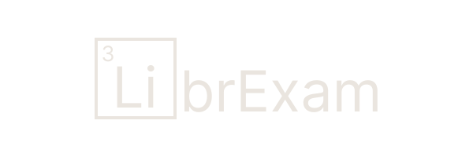

## [LibrExam](https://www.github.com/librexam/librexam.github.io)

 
is a powerful, fully static, and (optionally) decentralised test and quizzing engine - powered by Vue.js. [Check out the development branch!](https://github.com/sayakdattagupta/librexam-dev)
Project is very much WIP and still alpha.

Also, check out the [repo](https://github.com/librexam/testReoi) where I am hosting the sample tests.

## Philosophy
I realize this project might not exactly be 'libre', hence, to avoid any potential feuds, I have used a creative naming scheme (LibrE).

All tests and quizzes are typed out in JSON, making distribution incredibly easy.

A collection of tests can be hosted in a repo, and can be indexed, with the index link being shared - effectively allowing decentralised hosting of tests.

Even though images for questions currently need to be hosted (using a service like ImgBB, for example), then linked separately - A feature where each test JSON is bundled into a zip together with its own assets folder might be implemented - thus making the entire thing decentralised, if need be.

## Features 
Test loading, 
Test browsing (indexed repos), 
Ability to manage multiple tests (paused or submitted), 
The actual test ui is mostly complete (question rendering, question nav (drawer for smaller screens), marked or viewed or answered questions), 
Supports SMCQ, MMCQ and Numerical questions, 
Ability to load images for questions, ,
KaTeX support, 
A dark theme/light theme toggle, 
A rudimentary results page 

### To be done
A more advanced results page,  
Better UI (....),  
Code optimization,  
A functioning WYSWYG test maker *(maybe...)*, or at least a guide on how to write out tests (the sample provided should be enough of a clue, however),  
Bundling tests into zips, along with their images *(maybe...)*, 
Audio support
